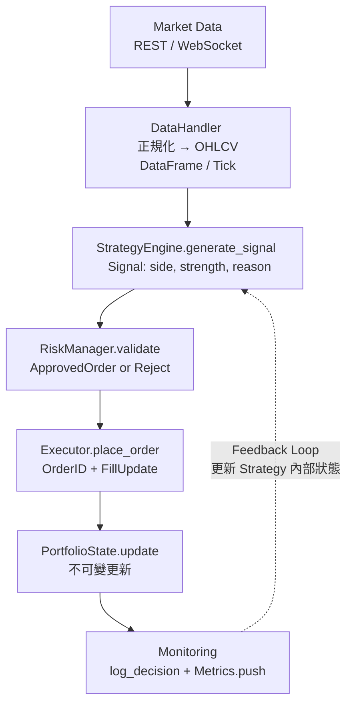

# 商業化 Automated Trading Strategies 系統架構設計與實作藍圖

## 1. 任務理解與主要假設

任務目標是為「商業化 Automated Trading Strategies」設計一個**可維護、可測試、可擴充、可追蹤、可除錯**的工程級整體流程與架構，而非單一策略實作。商業化意味著必須滿足生產環境需求：低延遲、強容錯、高可觀測性、合規審計、風險控管、以及能快速迭代多策略而不破壞既有系統。

**主要假設**：
- **市場**：以加密貨幣（Binance/CCXT）或美股（Alpaca/Interactive Brokers）為主，可透過 Adapter 切換；不假設特定資產類別。
- **頻率**：中低頻（分鐘~日線），非極高頻交易（HFT 需 FPGA/C++，本設計不涵蓋）。
- **技術棧**：Python 3.11+ + pandas + numpy（核心計算）+ 標準庫 logging/abc/dataclasses；不引入不必要套件（如 backtrader、TA-Lib），除非後續明確需求。
- **部署**：單機或 Docker 容器化，支援 paper trading → live trading 無縫切換。
- **使用者角色**：具備 quant 基礎與 broker API 金鑰管理能力；合規責任由使用者自行承擔（台灣/香港/美國法規不同）。
- **無特定策略細節**：提供**可插拔策略框架**，使用者可輕鬆替換策略實作。
- **商業化等級**：需具備完整 error handling、circuit breaker、結構化日誌、metrics 輸出，以及 shadow trading能力。

---

## 2. 建議架構與模組切分

採用 **Layered Architecture + Interface-driven Design + Dependency Injection**，嚴格遵循 SRP (單一職責) 與 SoC (關注點分離)。

- **配置層**：集中管理所有參數（避免 magic number / hardcode）。
- **資料層**：負責資料擷取、正規化、儲存（歷史與即時分離）。
- **策略層**：純計算邏輯，只負責 signal 生成（不碰風險與執行）。
- **風險層**：獨立決策「是否允許下單、倉位大小、停損停利」。
- **執行層**：負責 order 建構、發送、回填處理（透過 Adapter 抽象 broker）。
- **回測層**：事件驅動模擬器，可與 live 共用核心邏輯。
- **監控層**：結構化日誌、metrics、alert（Prometheus 格式輸出）。
- **編排層**：LiveTrader / Backtester 作為最高層，注入所有依賴。

### 模組邊界（每個檔案單一職責）
- `config.py`：配置載入與驗證
- `interfaces.py`：所有抽象介面（IStrategy, IDataHandler, IRiskManager, IExecutor）
- `data_handler.py`：DataHandler
- `strategy.py`：BaseStrategy + 範例 MovingAverageStrategy
- `risk_manager.py`：RiskManager
- `executor.py`：Executor + PaperExecutor / LiveExecutor
- `backtester.py`：Backtester
- `live_trader.py`：LiveTrader（主迴圈）
- `monitoring.py`：LoggerFactory + MetricsCollector
- `utils.py`：純工具函式（無狀態）

所有高層模組透過建構子注入依賴，方便單元測試替換為 Mock。

---

## 3. 資料流



**回測模式**：將 LiveData 替換為 HistoricalData + SimulatorExecutor，核心邏輯完全相同（同一套 Strategy + RiskManager）。
**即時模式**：使用 asyncio + queue 處理 tick/bar，非同步但保持單執行緒避免 race condition。

---

## 4. 實作步驟與任務進度

- [x] **1. 需求定義與介面設計**（本設計文件）
- [ ] **2. 配置層實作**（`config.py` 集中所有參數）
- [ ] **3. 資料層實作**（先支援歷史 CSV/Parquet，後加即時 Adapter）
- [ ] **4. 策略層實作**（從抽象類別開始，確保可單獨測試）
- [ ] **5. 風險層實作**（先做最基本 exposure limit + position sizing）
- [ ] **6. 執行層實作**（先做 PaperExecutor，驗證後再接真實 Broker）
- [ ] **7. 回測引擎實作**（事件迴圈，支援 bar-by-bar）
- [ ] **8. LiveTrader 編排**（注入所有依賴 + graceful shutdown）
- [ ] **9. 監控與錯誤處理**（結構化日誌 + circuit breaker）
- [ ] **10. 驗證與穩定化**（單元測試 → 整合測試 → paper trading → live）

---

## 5. 核心程式碼設計展示

### 模組 1: `config.py`
```python
from dataclasses import dataclass
from typing import Dict, Any
import os
import yaml

@dataclass(frozen=True)
class TradingConfig:
    symbol: str
    timeframe: str
    short_window: int
    long_window: int
    max_position_pct: float = 0.05
    risk_per_trade_pct: float = 0.01
    paper_trading: bool = True
    log_level: str = "INFO"

    @classmethod
    def from_yaml(cls, path: str = "config.yaml") -> "TradingConfig":
        with open(path, "r", encoding="utf-8") as f:
            data = yaml.safe_load(f)
        return cls(**data["trading"])
```

### 模組 2: `interfaces.py`
```python
from abc import ABC, abstractmethod
from dataclasses import dataclass
from typing import Optional, Dict
import pandas as pd

@dataclass(frozen=True)
class Signal:
    side: str          # "BUY" / "SELL" / "HOLD"
    strength: float    # 0~1
    reason: str
    timestamp: pd.Timestamp

class IStrategy(ABC):
    @abstractmethod
    def generate_signal(self, window: pd.DataFrame) -> Signal:
        pass

class IRiskManager(ABC):
    @abstractmethod
    def validate(self, signal: Signal, portfolio: Dict) -> Optional[Dict]:
        """回傳 order dict 或 None（拒絕）"""
        pass

class IExecutor(ABC):
    @abstractmethod
    def place_order(self, order: Dict) -> Dict:
        pass
```

### 模組 3: `strategy.py`
```python
import pandas as pd
import numpy as np
from interfaces import IStrategy, Signal

class MovingAverageCrossover(IStrategy):
    def __init__(self, short_window: int, long_window: int):
        if short_window >= long_window:
            raise ValueError("short_window must < long_window")
        self.short = short_window
        self.long = long_window

    def generate_signal(self, window: pd.DataFrame) -> Signal:
        if len(window) < self.long:
            return Signal("HOLD", 0.0, "insufficient_data", window.index[-1])
        
        close = window["close"]
        short_ma = close.rolling(self.short).mean().iloc[-1]
        long_ma = close.rolling(self.long).mean().iloc[-1]
        
        if short_ma > long_ma:
            return Signal("BUY", 0.8, f"MA_crossover_{self.short}>{self.long}", window.index[-1])
        elif short_ma < long_ma:
            return Signal("SELL", 0.8, f"MA_crossover_{self.short}<{self.long}", window.index[-1])
        return Signal("HOLD", 0.0, "no_crossover", window.index[-1])
```

### 模組 4: `risk_manager.py`
```python
from interfaces import IRiskManager, Signal
from typing import Dict, Optional

class SimpleRiskManager(IRiskManager):
    def __init__(self, max_position_pct: float, risk_per_trade_pct: float):
        self.max_pos = max_position_pct
        self.risk_per = risk_per_trade_pct

    def validate(self, signal: Signal, portfolio: Dict) -> Optional[Dict]:
        if signal.side == "HOLD":
            return None
        current_exposure = portfolio.get("exposure_pct", 0.0)
        if current_exposure + self.max_pos > 1.0:
            return None  # 超過總曝險上限
        order_size = self.risk_per * portfolio["equity"] / signal.strength
        return {
            "symbol": portfolio["symbol"],
            "side": signal.side,
            "qty": round(order_size / portfolio["price"], 4),
            "reason": signal.reason
        }
```

### 模組 5: `live_trader.py`
```python
import logging
import time
from typing import Dict
from interfaces import IStrategy, IRiskManager, IExecutor
from monitoring import get_logger

logger = get_logger(__name__)

class LiveTrader:
    def __init__(self, strategy: IStrategy, risk: IRiskManager, executor: IExecutor,
                 data_handler, config):
        self.strategy = strategy
        self.risk = risk
        self.executor = executor
        self.data_handler = data_handler
        self.config = config
        self.portfolio = {"equity": 100000.0, "exposure_pct": 0.0, "symbol": config.symbol}

    def run(self):
        logger.info("LiveTrader started", extra={"config": self.config})
        try:
            while True:
                bar = self.data_handler.get_latest_bar()
                signal = self.strategy.generate_signal(bar)
                approved = self.risk.validate(signal, self.portfolio)
                if approved:
                    result = self.executor.place_order(approved)
                    self._update_portfolio(result)
                    logger.info("Order executed", extra={"order": approved, "result": result})
                time.sleep(60)  # 依 timeframe 調整
        except KeyboardInterrupt:
            logger.warning("Graceful shutdown initiated")
        except Exception as e:
            logger.error("Critical failure", exc_info=True)
            raise  # Fail fast

    def _update_portfolio(self, fill: Dict):
        # 不可變更新（實際應使用 dataclass 或 pydantic）
        self.portfolio = {**self.portfolio, **fill}
```

---

## 6. 驗證方式與測試案例

- **單元測試**（`pytest` + `pytest-mock`）：每個類別獨立測試，注入 Mock。
  - `test_ma_crossover_generates_buy_when_short_crosses_above()`
  - `test_risk_rejects_when_exposure_exceeds_limit()`
  - `test_executor_paper_does_not_call_real_api()`
- **整合測試**：使用固定歷史資料（已知結果的 2020-2023 BTC 日線），驗證最終 equity curve 與手動計算一致。
- **回測驗證**：實作 Sharpe、MaxDrawdown、Calmar Ratio 計算函式，與已知 benchmark 比對。
- **Paper Trading**：連續運行 7~14 天，比較 paper P&L 與 backtest 差異（slippage 模型）。
- **壓力測試**：模擬 API timeout、nan 資料、極端行情（-30% flash crash）、網路中斷 → 確認 circuit breaker 觸發且系統不崩潰。
- **可觀測性檢查**：所有決策皆有結構化 log（包含 signal.reason、portfolio snapshot、latency），可用 ELK 或 Loki 查詢。
- **Code Quality**：`mypy` 型別檢查、`ruff` lint、test coverage ≥ 85%。

---

## 7. 可能風險與後續可優化方向

**主要風險**：
- **回測過度擬合 (Overfitting)**：即使框架正確，策略仍可能失效。**必須**使用 Walk-Forward + Purged K-Fold。
- **執行滑價與延遲**：Paper 與 Live 差異常被低估。
- **單點故障**：無 broker 備援、資料來源單一 → 建議多 broker + 資料源 failover。
- **API 金鑰洩漏與 rate limit**：使用 secrets manager + exponential backoff + circuit breaker。

**後續可優化方向**（依優先序）：
1. **加入 Shadow Trading**：Live 策略同時運行 shadow 策略，比較績效。
2. **多策略 Portfolio**：加入 Allocator 模組（風險平價或 Kelly Criterion）。
3. **即時監控 Dashboard**：Grafana + Prometheus（metrics 已在 monitoring 層準備）。
4. **雲端原生部署**：Docker + Kubernetes + auto-scaling（多實例同時運行不同策略）。
5. **策略版本控管 + A/B Testing**：Git tag 策略版本，支援動態切換。
6. **進階風險**：加入 VaR、CVaR、動態倉位（ATR-based）。
